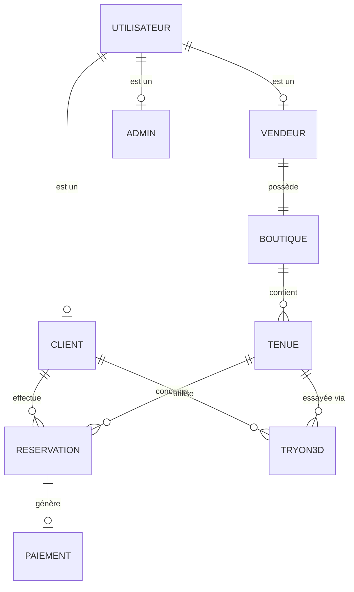

<div align="center">

# 🌸 Dress by Ameksa

### ✨ Plateforme de location de caftans et takchitas ✨

[](https://mongodb.com)
[](https://expressjs.com)
[](https://reactjs.org)
[](https://nodejs.org)

[](https://tailwindcss.com)
[](https://jwt.io)
[](https://cloudinary.com)

<br/>


<br/>

**🇲🇦 Moderniser la location de tenues traditionnelles marocaines**

[Démo](#-demo) • [Fonctionnalités](#-fonctionnalités) • [Installation](#-installation) • [Documentation](#-documentation)

</div>

---

## 📖 À propos

**Dress by Ameksa** est une plateforme web innovante qui révolutionne la location de **caftans**, **takchitas** et **robes de soirée** au Maroc.

<table>
<tr>
<td width="50%">

### 🎯 Notre Mission

Connecter les **clientes** à la recherche de la tenue parfaite avec les **boutiques** proposant les plus beaux modèles traditionnels marocains.

</td>
<td width="50%">

### 💡 Innovation

Grâce à notre technologie **3D Try-On basée sur l'IA**, visualisez la tenue sur vous avant de réserver !

</td>
</tr>
</table>

---

## ⭐ Fonctionnalité Phare : Try-On 3D avec IA

<div align="center">

```
┌─────────────────────────────────────────────────────────────────┐
│                    🪄 ESSAYAGE VIRTUEL 3D                       │
├─────────────────────────────────────────────────────────────────┤
│                                                                 │
│   1️⃣  Choisissez une tenue (caftan/takchita)                   │
│                           ↓                                     │
│   2️⃣  Remplissez le formulaire morphologique                   │
│       • Taille (cm)  • Poids (kg)                              │
│       • Couleur de peau  • Morphologie                         │
│                           ↓                                     │
│   3️⃣  L'IA Gemini génère votre avatar 3D                      │
│                           ↓                                     │
│   4️⃣  Visualisez la tenue sur VOUS !                          │
│                           ↓                                     │
│   5️⃣  Téléchargez ou réservez directement                     │
│                                                                 │
└─────────────────────────────────────────────────────────────────┘
```

</div>

---

## 👥 Acteurs du Système

<div align="center">

| | Acteur | Description | Auth |
|:---:|:---|:---|:---:|
| 👁️ | **Visiteur** | Consulte le catalogue sans compte | ❌ |
| 👗 | **Client** | Réserve des tenues, utilise Try-On 3D | ✅ |
| 🏪 | **Vendeur** | Gère sa boutique et ses tenues | ✅ |
| 👑 | **Admin** | Supervise toute la plateforme | ✅ |

</div>

### 🔗 Systèmes Externes

```
┌──────────────┐    ┌──────────────┐    ┌──────────────┐    ┌──────────────┐
│  🤖 Gemini   │    │  📧 Email    │    │  💳 Paiement │    │  ☁️ Cloudinary│
│   API IA     │    │   Service    │    │   Service    │    │   Images     │
└──────────────┘    └──────────────┘    └──────────────┘    └──────────────┘
```

---

## 🎨 Fonctionnalités

<details>
<summary><b>👁️ Espace Visiteur</b> (Sans authentification)</summary>

<br/>

| Fonctionnalité | Description |
|:---|:---|
| 🏠 Page d'accueil | Découverte du concept, modèles populaires |
| 📚 Catalogue | Parcourir toutes les tenues disponibles |
| 🔍 Recherche | Filtrer par type, couleur, prix, taille |
| 👀 Détails tenue | Photos HD, description, disponibilité |
| 🏪 Boutiques | Consulter les boutiques partenaires |
| 📝 Inscription | Créer un compte Client ou Vendeur |

</details>

<details>
<summary><b>👗 Espace Client</b> (Authentification requise)</summary>

<br/>

| Fonctionnalité | Description |
|:---|:---|
| 🪄 **Try-On 3D** | Essayage virtuel avec IA Gemini |
| 📅 Réservation | Sélection dates + paiement sécurisé |
| 👤 Profil | Gérer ses informations personnelles |
| 📋 Historique | Voir toutes ses réservations |
| 🔔 Notifications | Recevoir les confirmations par email |

</details>

<details>
<summary><b>🏪 Espace Vendeur</b> (Authentification requise)</summary>

<br/>

| Fonctionnalité | Description |
|:---|:---|
| 🏬 Ma Boutique | Créer et configurer sa boutique |
| ➕ Ajouter tenue | Nom, description, prix, images |
| ✏️ Modifier tenue | Mettre à jour les informations |
| 🗑️ Supprimer tenue | Retirer une tenue du catalogue |
| 📊 Réservations | Confirmer/Refuser les demandes |
| 📈 Statistiques | Performances de la boutique |

</details>

<details>
<summary><b>👑 Espace Admin</b> (Authentification requise)</summary>

<br/>

| Fonctionnalité | Description |
|:---|:---|
| ✅ Valider boutiques | Approuver les nouvelles boutiques |
| 🚫 Suspendre | Désactiver une boutique problématique |
| 👥 Utilisateurs | Gérer clients, vendeurs, admins |
| 📊 Dashboard | Statistiques globales de la plateforme |
| 💰 Commissions | Gérer les revenus et commissions |
| ⚖️ Litiges | Résoudre les conflits |

</details>

---

## 🏗️ Architecture du Projet

```
dress-by-ameksa/
│
├── 📁 frontend/                 # Application React
│   ├── 📁 src/
│   │   ├── 📁 components/       # Composants réutilisables
│   │   ├── 📁 pages/            # Pages de l'application
│   │   │   ├── 📁 public/       # Accueil, Catalogue, Détails
│   │   │   ├── 📁 client/       # Espace Client
│   │   │   ├── 📁 vendeur/      # Espace Vendeur
│   │   │   └── 📁 admin/        # Espace Admin
│   │   ├── 📁 context/          # Context API (Auth, Cart)
│   │   ├── 📁 hooks/            # Custom Hooks
│   │   ├── 📁 services/         # Appels API
│   │   └── 📁 utils/            # Fonctions utilitaires
│   └── 📄 package.json
│
├── 📁 backend/                  # Serveur Node.js/Express
│   ├── 📁 controllers/          # Logique métier
│   ├── 📁 models/               # Schémas MongoDB
│   │   ├── 📄 User.js           # Utilisateur (parent)
│   │   ├── 📄 Client.js
│   │   ├── 📄 Vendeur.js
│   │   ├── 📄 Admin.js
│   │   ├── 📄 Boutique.js
│   │   ├── 📄 Tenue.js
│   │   ├── 📄 Reservation.js
│   │   └── 📄 TryOn.js
│   ├── 📁 routes/               # Routes API
│   ├── 📁 middleware/           # Auth, Validation
│   ├── 📁 config/               # Configuration DB
│   └── 📄 server.js
│
├── 📁 docs/                     # Documentation
│   ├── 📄 diagramme-classe.drawio
│   └── 📄 diagramme-cas-utilisation.drawio
│
└── 📄 README.md
```

---

## 🗃️ Modèle de Données



### 📊 Classes Principales

<div align="center">

| Classe | Attributs clés |
|:---:|:---|
| 👤 **Utilisateur** | `_id`, `nom`, `email`, `motDePasse`, `role` |
| 👗 **Client** | `favoris`, `historiqueReservations` |
| 🏪 **Vendeur** | `boutique`, `estVerifie`, `commission` |
| 👑 **Admin** | `permissions`, `niveauAcces` |
| 🏬 **Boutique** | `nom`, `logo`, `adresse`, `statut` |
| 👘 **Tenue** | `nom`, `type`, `prix`, `images`, `disponibilite` |
| 📅 **Reservation** | `dateDebut`, `dateFin`, `statut`, `prixTotal` |
| 🪄 **TryOn3D** | `taille`, `poids`, `morphologie`, `imageGeneree` |

</div>

---

## 🛠️ Stack Technique

<div align="center">

### Frontend


### Backend


### Services


</div>

---

## 🚀 Installation

### Prérequis

- 
- 
- Compte [Cloudinary](https://cloudinary.com)
- Clé API [Gemini](https://ai.google.dev)

### 📥 Cloner le projet

```bash
git clone https://github.com/votre-username/dress-by-ameksa.git
cd dress-by-ameksa
```

### ⚙️ Configuration Backend

```bash
# Aller dans le dossier backend
cd backend

# Installer les dépendances
npm install

# Créer le fichier .env
cp .env.example .env
```

Configurer le fichier `.env` :

```env
# Serveur
PORT=5000
NODE_ENV=development

# Base de données
MONGODB_URI=mongodb://localhost:27017/dressByAmeksa

# Authentification
JWT_SECRET=votre_secret_jwt_super_securise
JWT_EXPIRE=7d

# Cloudinary
CLOUDINARY_CLOUD_NAME=votre_cloud_name
CLOUDINARY_API_KEY=votre_api_key
CLOUDINARY_API_SECRET=votre_api_secret

# Gemini AI
GEMINI_API_KEY=votre_cle_gemini

# Email (optionnel)
EMAIL_SERVICE=gmail
EMAIL_USER=votre_email
EMAIL_PASS=votre_mot_de_passe_app
```

### ⚙️ Configuration Frontend

```bash
# Aller dans le dossier frontend
cd ../frontend

# Installer les dépendances
npm install

# Créer le fichier .env
cp .env.example .env
```

```env
REACT_APP_API_URL=http://localhost:5000/api
```

### ▶️ Démarrer l'application

```bash
# Terminal 1 - Backend
cd backend
npm run dev

# Terminal 2 - Frontend
cd frontend
npm start
```

<div align="center">

🎉 **L'application est accessible sur** `http://localhost:3000`

</div>

---

## 📅 Planning de Développement

<div align="center">

| Sprint | Description | Durée |
|:---:|:---|:---:|
| 1️⃣ | Maquettes UI/UX & Architecture | 1 sem |
| 2️⃣ | Frontend : Catalogue + Détails | 1 sem |
| 3️⃣ | Backend : Auth + Tenues | 1 sem |
| 4️⃣ | Système de Réservation | 1 sem |
| 5️⃣ | **Espace Vendeur** | 1 sem |
| 6️⃣ | Panel Admin | 1 sem |
| 7️⃣ | **Try-On 3D avec IA** | 2 sem |
| 8️⃣ | Tests & Optimisation | 1 sem |
| 9️⃣ | Documentation & Présentation | 1 sem |

</div>

---

## 📚 Documentation

| Document | Description |
|:---|:---|
| 📄 [Cahier des charges](./docs/cahier-des-charges.pdf) | Spécifications complètes du projet |
| 📊 [Diagramme de classe](./diagramme-classe-dressByAmeksa.drawio) | Architecture des données |
| 🔄 [Diagramme cas d'utilisation](./diagramme-cas-utilisation-dressByAmeksa.drawio) | Interactions utilisateurs |
| 🎨 [Maquettes Figma](#) | Design UI/UX |
| 📖 [API Documentation](#) | Endpoints REST |

---

## 🔐 Sécurité

<div align="center">

| Mesure | Implémentation |
|:---:|:---|
| 🔑 | **JWT** pour l'authentification |
| 🔒 | **bcrypt** pour le hashage des mots de passe |
| 🛡️ | Middleware de vérification des rôles |
| ✅ | Validation des entrées (Joi/Express-validator) |
| 🚫 | Protection CORS configurée |
| 🗑️ | Suppression auto des images Try-On |

</div>

---

## 🤝 Contribution

Les contributions sont les bienvenues !

```bash
# 1. Fork le projet
# 2. Créer une branche
git checkout -b feature/ma-nouvelle-fonctionnalite

# 3. Commit les changements
git commit -m "feat: ajout de ma fonctionnalité"

# 4. Push sur la branche
git push origin feature/ma-nouvelle-fonctionnalite

# 5. Ouvrir une Pull Request
```

---

## 📄 License

Ce projet est sous licence **MIT**. Voir le fichier [LICENSE](LICENSE) pour plus de détails.

---

<div align="center">

## 💖 Remerciements

Merci à tous ceux qui contribuent à ce projet !

---

**Fait avec ❤️ au Maroc 🇲🇦**

<br/>

[](https://github.com/votre-username/dress-by-ameksa)

<br/>

*Projet Fil Rouge - Formation Développement Web Full Stack*

*© 2026 Dress by Ameksa - Tous droits réservés*

</div>
